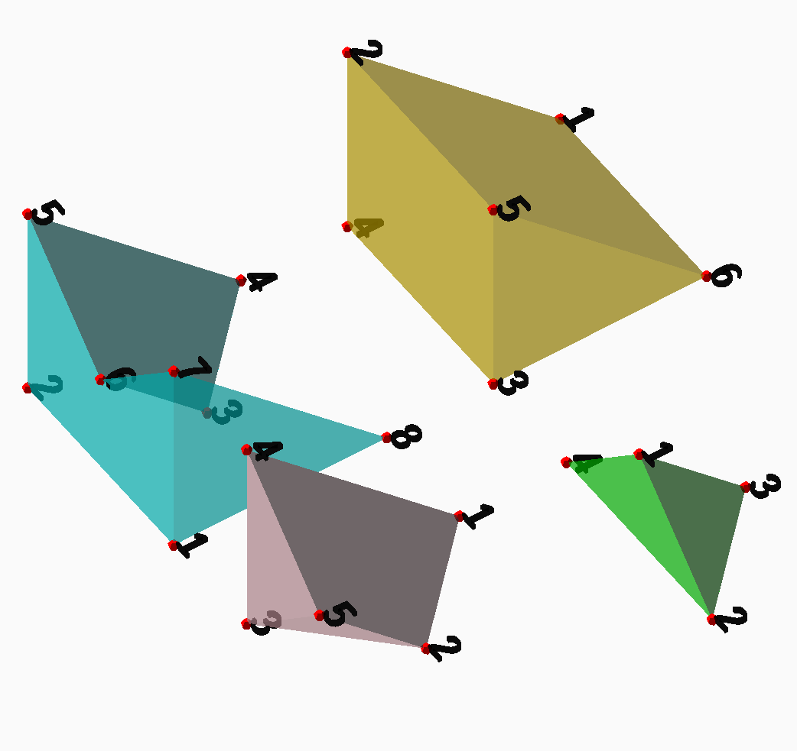

# ConstructiveGeometry


[](https://plut.github.io/ConstructiveGeometry.jl/dev/)

A module providing a syntax and tool
to define CAD objects directly as Julia scripts.

Currently a work in progress. What should work, at least in part:

 - an easy-to-use syntax for defining solids and CSG operations;
 - meshing of most 2d and 3d operations;
 - output format: OpenSCAD file.

This means that it should already be possible to use this module to
define basic 3d models:

```julia
using ConstructiveGeometry

t1 = Surface([[0,0,0],[2,0,0],[0,2,0],[0,0,2]],
  [[1,3,2],[1,4,3],[1,2,4],[2,3,4]])
t2 = Surface([[2,0,0],[0,0,0],[2,0,2],[2,2,0]],
  [[1,3,2],[1,4,3],[1,2,4],[2,3,4]])

Surface(t1 ∪ t2)
Surface(t1 ∩ t2)
Surface(t1 \ t2)
Surface(hull(t1, t2))
```

gives the following output:


OpenSCAD was used for rendering the image,
although not for computing the CSG operations.

The roadmap now includes at least the following:
 - built-in visualization of models;
 - direct mesh I/O from and to relevant file formats;
 - add more convenience constructors (e.g. for transforms);
 - improve speed of some algorithms by tweaking the associated data
	 structures;
 - implement missing operators: 3d Minkowski sum; 2d/3d Minkowski
	 difference; projection; some extrusions;
 - add a `text()` constructor;
 - add an annotation system to ease the design of complex models.

Any contributions are welcome!
