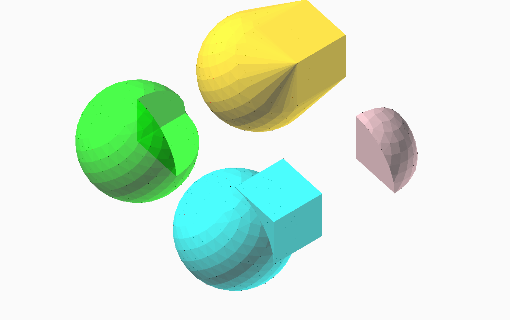

# ConstructiveGeometry


[](https://plut.github.io/ConstructiveGeometry.jl/dev/)

A module providing a syntax and tools
to define CSG objects in Julia.

This module is currently a work in progress,
roughly at the “proof of concept” stage.
The following work at least in some cases:

 - an easy-to-use syntax for defining solids and CSG operations;
 - meshing of most 2d and 3d operations;
 - output as an OpenSCAD file.

This means that it should already be possible to use this module to
define basic 3d models:
```julia
s1 = sphere(20)
s2 = cube(20)
mesh(s1 ∪ s2)
mesh(s1 ∩ s2)
mesh(s1 \ s2)
mesh(hull(s1, s2))
```
gives the following output:


OpenSCAD was used for rendering the image,
although not for computing the CSG operations.

The roadmap now includes at least the following:
 - built-in visualization of models;
 - direct mesh I/O from and to relevant file formats;
 - add more convenience constructors (e.g. for transforms);
 - improve speed of some algorithms by tweaking the associated data
	 structures;
 - implement missing operators: 3d Minkowski sum; 2d/3d Minkowski
	 difference; projection; some extrusions;
 - add a `text()` constructor;
 - add an annotation system to ease the design of complex models.

Any contributions are welcome!
